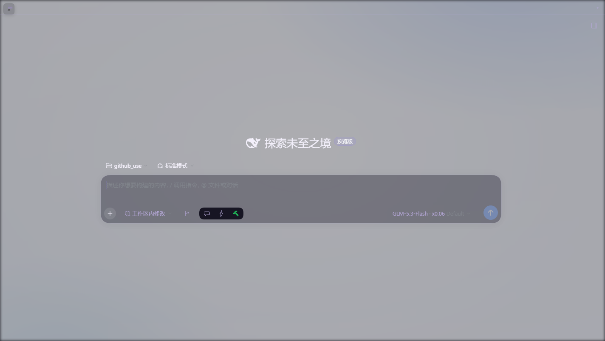

# dsh-rail-zero

[](LICENSE)

**把 DeepSeek Harness 左侧会话栏收起后那条 56px 空轨道彻底清零**，同时保证侧边栏仍然一键可展开。纯浏览器端 CSS/DOM 补丁，零宿主 API 依赖、零 peer 依赖，装上即生效。



## 解决什么问题

DSH 的左栏收起逻辑写死在 `@deepseek-ai/dsh-client-ui-layout` 的 AppFrame 里：

```js
computeColumns(viewport, sidebar, rightbar, collapsedWidth = 56)
// collapsedWidth = darwin || html[data-windows-titlebar] ? 0 : 56
```

只有 macOS（或带自绘标题栏的桌面壳）收起后是完全隐藏；**Windows/Linux 浏览器端收起后永远留一条 56px 的空轨道**。本插件把这条轨道清成 0，把空间还给对话区。

## 特性

- **只清第一列**：按段改写内联 `grid-template-columns` 的首段（`!important` 压过内联样式），右侧面板轨道不受影响；`MutationObserver` 对抗 React 重渲染（带守卫防循环）。
- **展开按钮三级复用，绝不重复造轮子**：
  1. 装了 [dsh-qol](https://github.com/) → 直接用它顶栏那个常驻汉堡（`.astb-sidebar-toggle`），本插件自己的按钮自动隐藏；
  2. 没有 qol → 点击官方 toggle（注意它收起态的 aria-label 是「打开侧边栏」）；
  3. 都没有 → 左上角浮出一枚 26px 的「»」小按钮兜底。
- **零依赖**：不 `require` 任何宿主模块（避开 0.2.0 的 client-modules 漂移坑），纯 DOM/CSS。
- 不改 DSH 任何源码/ bundle。

## 安装

```bash
dsh plugin --profile web add dsh-rail-zero
# 或 GitHub 直装：
dsh plugin --profile web add github:HelloQingTao/dsh-rail-zero
```

重启 `dsh web` 生效。卸载即完全还原。

## 兼容性

| DSH 版本 | 状态 |
|---|---|
| 0.2.0-rc.1 / 0.2.0-rc.2 | ✅ 实测 |
| 0.1.x | 未测（原理上兼容，欢迎反馈） |

与 dsh-qol 完全共存（复用其汉堡按钮）；与 dsh-better-sidebar、dsh-sidebar-qa 无冲突。

## 原理

见 [lib/client.js](lib/client.js) 头注释。

## License

[MIT](LICENSE)
